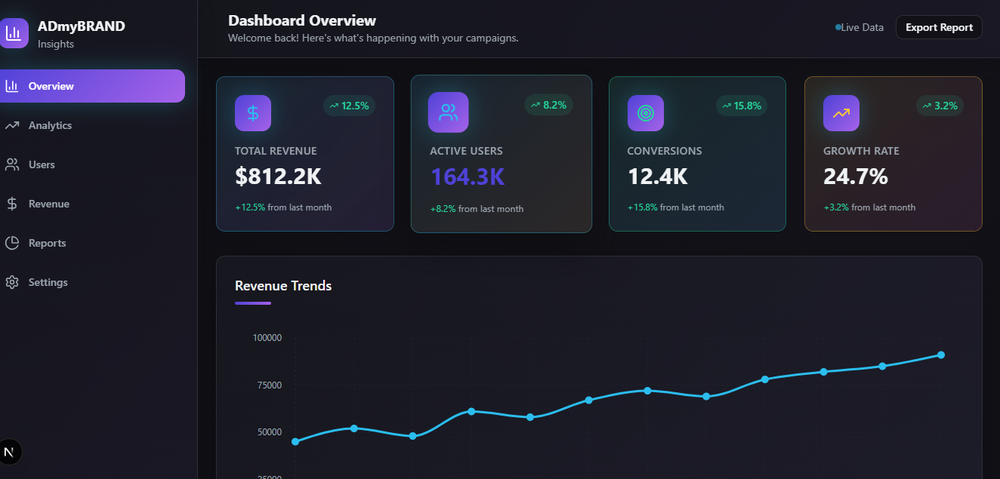
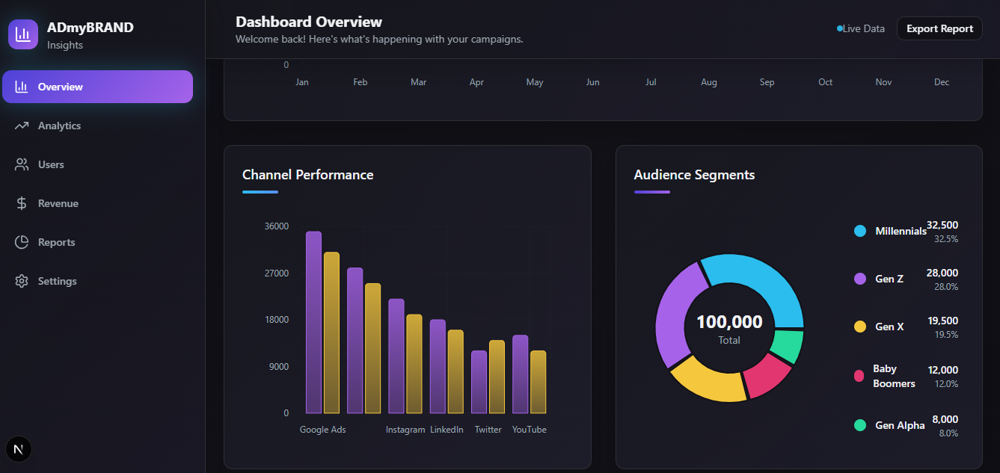
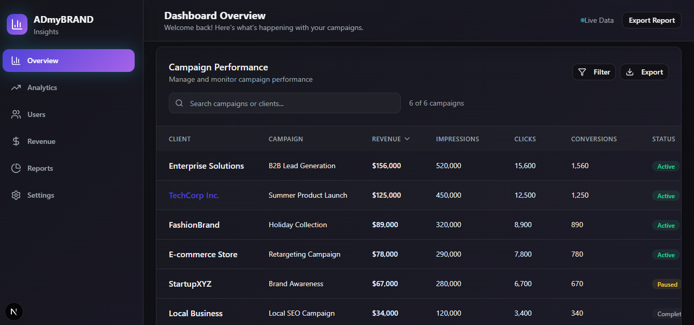
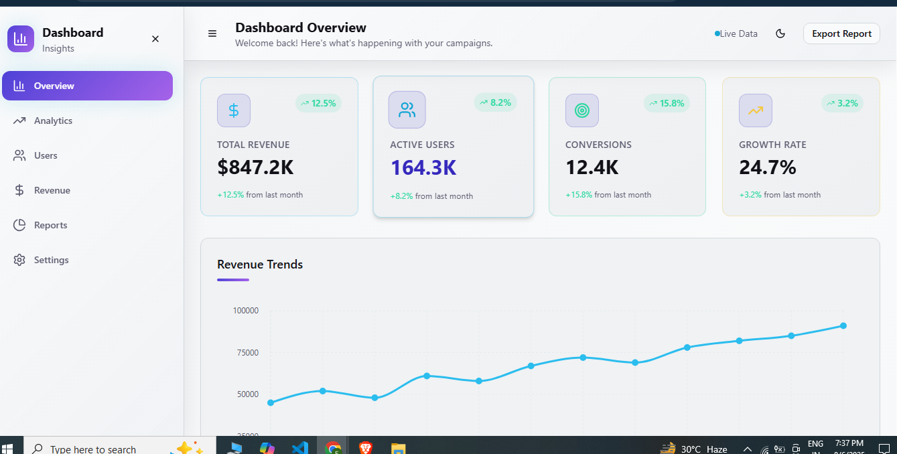

# 📊 Dashboard Web App

An interactive and visually appealing dashboard web application built to monitor and display campaign insights like **Revenue**, **Growth Rate**, **Active Users**, **Conversions**, and **Channel Performance** using elegant charts and metrics.

---

## 🚀 Project Overview

This dashboard helps marketing teams and businesses gain valuable insights into the performance of their ad campaigns. It is designed to be intuitive, responsive, and visually engaging.

Features include:
- 💵 Total Revenue, 👥 Active Users, 🎯 Conversions, 📈 Growth Rate
- 📊 Revenue Trends Line Chart
- 📉 Channel Performance Bar Graph
- 🎯 Audience Segments Donut Chart
- 🗂️ Campaign Performance Table
- 📎 Export Report Button

---

## 🛠️ Tech Stack

### Frontend
- **Next.js** (React Framework)
- **React.js**
- **Tailwind CSS** (Utility-first CSS for responsive design)
- **Mock Data** used in frontend during development

### Backend
- **Django** (Python Web Framework)
- **Django REST Framework (DRF)** for building API endpoints
- **Mock Data** used for testing instead of database integration

---

## 📁 Project Structure (Sample)

```

project-root/
│
├── backend/
│   ├── manage.py
│   ├── api/
│   │   ├── views.py
│   │   ├── urls.py
│   │   └── mockdata.json
│   └── ...
│
├── frontend/
│   ├── pages/
│   │   ├── index.tsx
│   │   └── api/
│   ├── components/
│   │   ├── Header.tsx
│   │   ├── Sidebar.tsx
│   │   └── ChartCards.tsx
│   ├── public/
│   │   ├── first-shot.png
│   │   ├── second-shot.png
│   │   └── third-shot.png
│   └── tailwind.config.js
│
└── README.md

````

---

## ⚙️ Setup Instructions

### Backend (Django + DRF)

1. **Install Dependencies**  
```bash
pip install -r requirements.txt
````

2. **Run Django Server**

```bash
python manage.py runserver
```

> Note: Mock data is served through DRF views without real DB queries.

---

### Frontend (Next.js + Tailwind)

1. **Install Dependencies**

```bash
npm install
# or
yarn install
```

2. **Start the Development Server**

```bash
npm run dev
# or
yarn dev
```

---

## 📦 Features in Development / Future Scope

* ✅ Replace mock data with actual database integration
* 📈 Add filters, date range selectors, and pagination
* 🔒 Implement user authentication & authorization
* 📤 Automated report generation & export in PDF/CSV formats
* 🌐 Responsive improvements for mobile & tablet views

---

## 📸 UI Preview






---

## 📃 License

This project is licensed for educational and demonstration purposes. Modify and enhance as per your requirements.

---

## 🤝 Acknowledgements

Thanks to:

* [Django](https://www.djangoproject.com/)
* [Next.js](https://nextjs.org/)
* [Tailwind CSS](https://tailwindcss.com/)
* [React](https://reactjs.org/)
